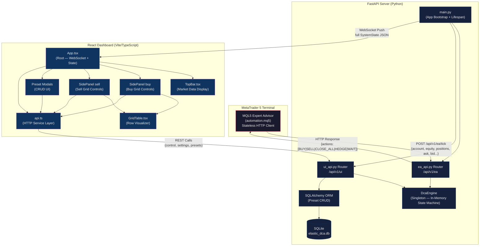
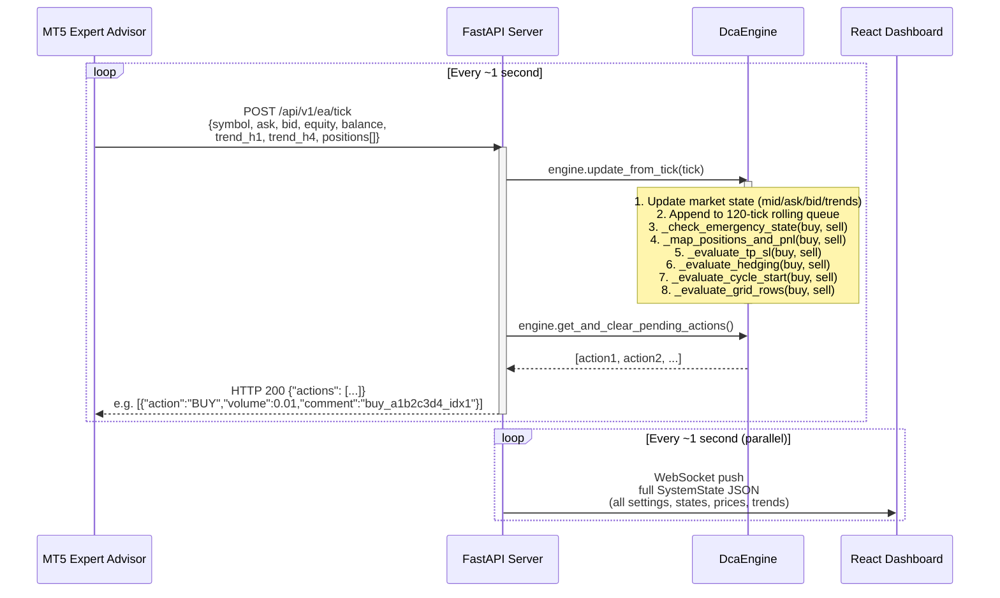
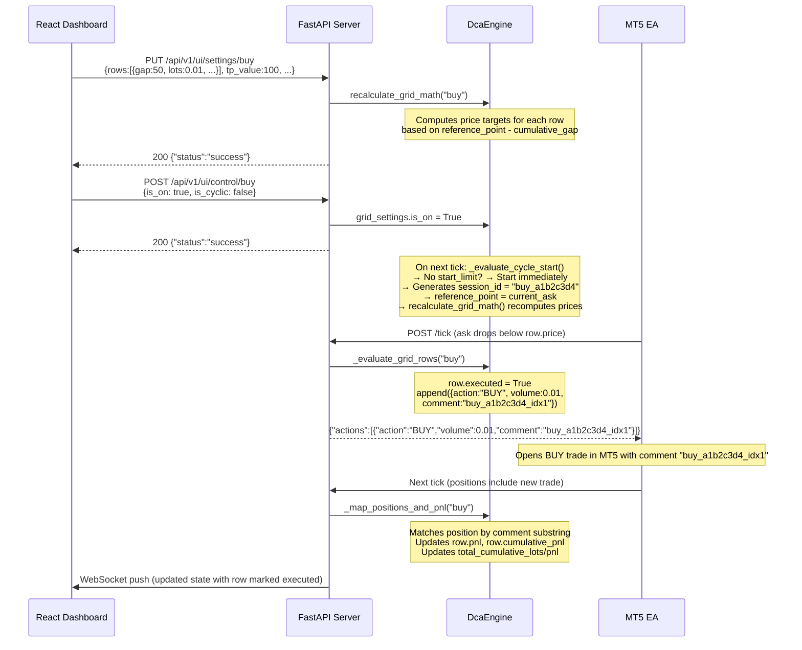
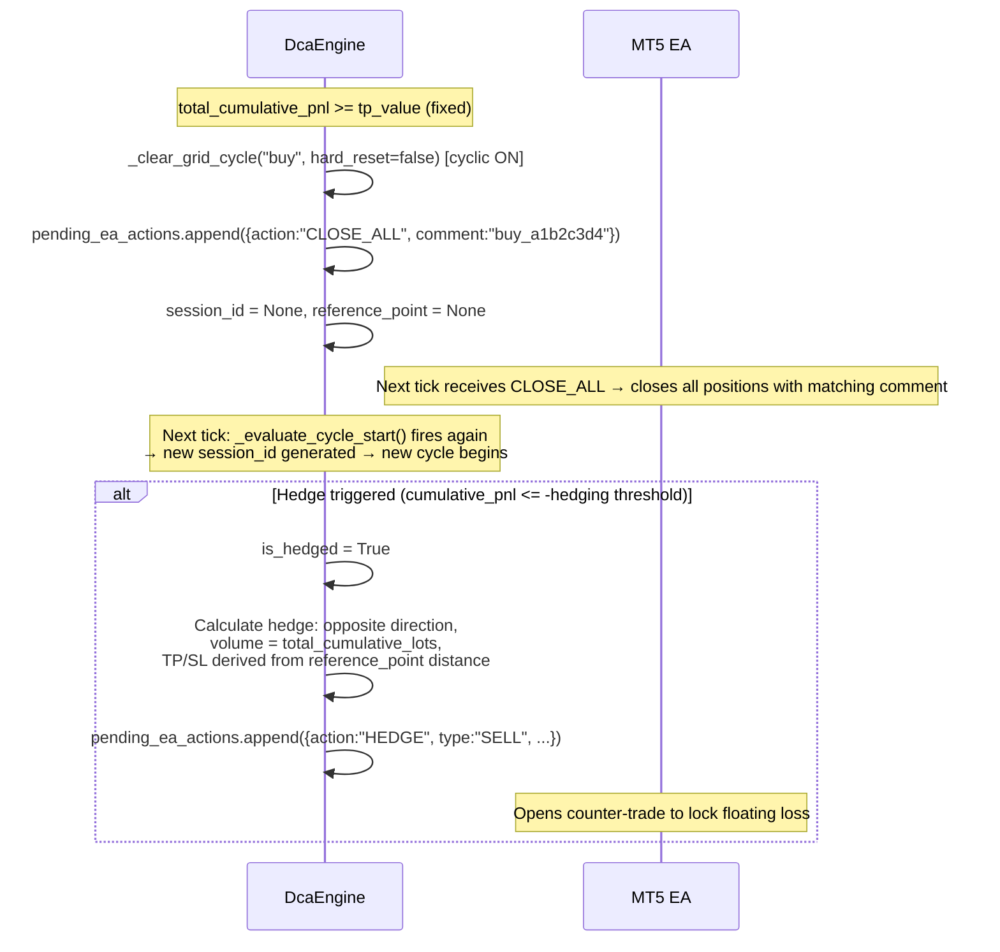
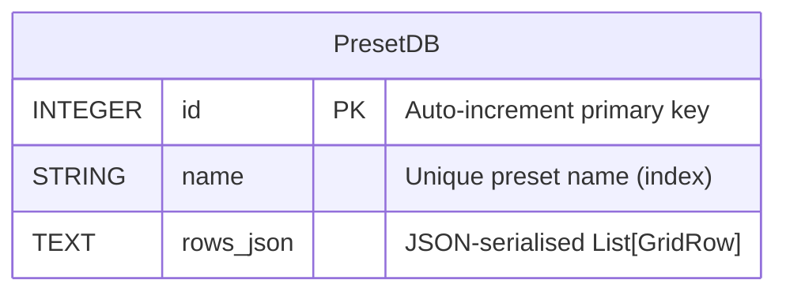
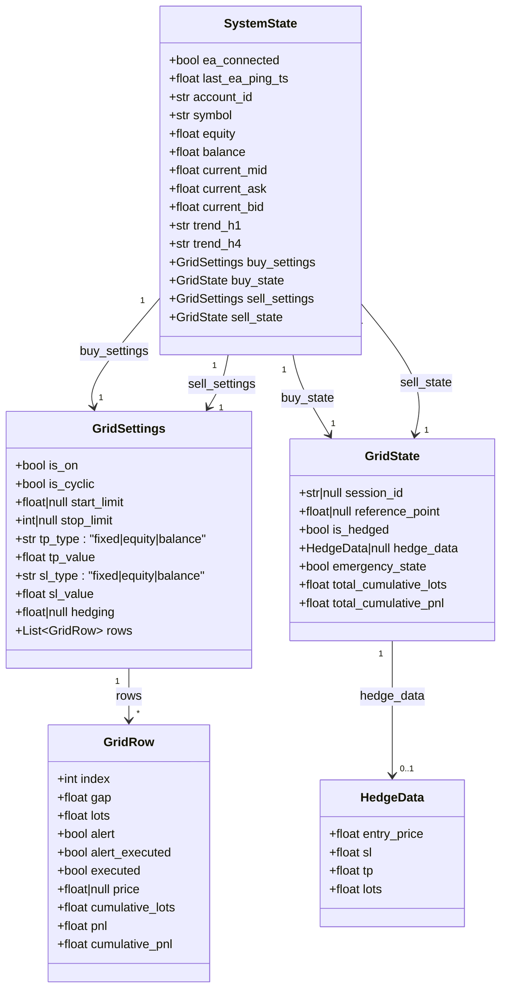

# System Architecture — Elastic DCA Engine v4

> **Generated:** April 2, 2026  
> **Source of truth:** Derived entirely from source code analysis.

---

## Table of Contents

1. [System Overview](#1-system-overview)
2. [Architecture Diagram](#2-architecture-diagram)
3. [Data Flow Diagram](#3-data-flow-diagram)
4. [Component Breakdown](#4-component-breakdown)
5. [Database Schema](#5-database-schema)
6. [In-Memory State Model](#6-in-memory-state-model)
7. [Key Design Patterns](#7-key-design-patterns)
8. [Cross-Cutting Concerns](#8-cross-cutting-concerns)
9. [Extension Points](#9-extension-points)

---

## 1. System Overview

The Elastic DCA Engine is a **three-tier, event-driven system** connecting a MetaTrader 5 Expert Advisor (MQL5) to a Python state engine and a React dashboard.

The architecture is deliberately **server-centric**: all trading intelligence lives in the Python `DcaEngine` singleton, not inside the MT5 terminal. The EA is a thin, stateless client that polls the server every second and executes instructions it receives back.

```
MetaTrader 5 (EA)  ←──HTTP──→  FastAPI Server  ←──WebSocket──→  React UI
   (MQL5 script)                 (DcaEngine)                    (Dashboard)
                                       │
                                    SQLite
                                   (Presets)
```

**Communication contracts:**

| Link        | Protocol                               | Direction                    | Frequency              |
| ----------- | -------------------------------------- | ---------------------------- | ---------------------- |
| EA → Server | HTTP POST `/api/v1/ea/tick`            | EA pushes tick data          | Every 1 second         |
| Server → EA | HTTP Response body `{"actions":[...]}` | Server pushes queued actions | On every tick response |
| Server → UI | WebSocket `/api/v1/ui/ws`              | Server streams full state    | Every 1 second         |
| UI → Server | HTTP REST `/api/v1/ui/*`               | UI pushes settings/commands  | On user interaction    |

---

## 2. Architecture Diagram



---

## 3. Data Flow Diagram

### Primary Flow: 1-Second Tick Cycle



### Grid Row Execution Flow



### TP / Hedge / Cyclic Flow



---

## 4. Component Breakdown

### `main.py` — Application Bootstrap

- Initialises SQLite tables via `Base.metadata.create_all()`.
- Registers a `lifespan` async context manager that starts the **EA Timeout Watcher** background task: a coroutine that calls `engine.check_ea_timeout()` every second. If no tick is received within `EA_TIMEOUT_SECONDS`, it marks the EA as disconnected and performs a hard reset of both grids.
- Mounts two routers:
  - `ea_api.router` at `/api/v1/ea`
  - `ui_api.router` at `/api/v1/ui`
- Applies a CORS middleware with wildcard origins (intended to be tightened in production).
- Suppresses Uvicorn access logs for `/tick` and `/ws` to avoid log spam.

### `DcaEngine` (`services/engine.py`) — The State Machine

The single most important component. Instantiated once as a module-level singleton (`engine = DcaEngine()`), shared across all request handlers.

**State it holds:**

- `self.state: SystemState` — the complete, serialisable live state of the system.
- `self.tick_queue: deque(maxlen=120)` — rolling 2-minute window of tick data for crossover calculations.
- `self.pending_ea_actions: list` — FIFO queue of action dicts the EA picks up on its next ping.
- `self.ticks_processed: int` — monotonic counter for health reporting.

**Processing pipeline (called every second per tick):**

| Step | Method                     | Purpose                                           |
| ---- | -------------------------- | ------------------------------------------------- |
| 1    | `update_from_tick()`       | Updates market data, increments counter           |
| 2    | `_check_emergency_state()` | Detects orphaned/zombie trades                    |
| 3    | `_map_positions_and_pnl()` | Syncs P&L from EA positions                       |
| 4    | `_evaluate_tp_sl()`        | Triggers CLOSE_ALL if TP or SL thresholds met     |
| 5    | `_evaluate_hedging()`      | Deploys counter-trade if loss exceeds hedge limit |
| 6    | `_evaluate_cycle_start()`  | Initiates new session if conditions met           |
| 7    | `_evaluate_grid_rows()`    | Triggers BUY/SELL orders on price crossover       |

### `ea_api.py` — EA Communication Router

Exposes a single endpoint (`POST /api/v1/ea/tick`) that:

1. Receives a validated `TickData` payload.
2. Calls `engine.update_from_tick(tick)`.
3. Calls `engine.get_and_clear_pending_actions()`.
4. Returns all pending actions in a bulk `{"actions": [...]}` array.

All exceptions are caught and return `{"actions": []}`, ensuring the EA always receives a valid response.

### `ui_api.py` — Dashboard & Preset Router

Two responsibilities:

**WebSocket endpoint** (`GET /api/v1/ui/ws`): An infinite loop that serialises `engine.state` to JSON and pushes it to the connected browser client every second.

**REST endpoints**: Stateless handlers that mutate `engine.state` in-place. Executed rows are write-protected — the settings update endpoint enforces that the `gap`, `lots` of any already-executed row cannot be changed while the grid is running.

---

## 5. Database Schema

SQLite is used exclusively for **preset persistence**. All live trading state is in-memory only.



**Table:** `presets`

| Column      | Type    | Constraints             | Description                              |
| ----------- | ------- | ----------------------- | ---------------------------------------- |
| `id`        | INTEGER | PRIMARY KEY, NOT NULL   | Auto-incrementing ID                     |
| `name`      | STRING  | UNIQUE, NOT NULL, INDEX | Human-readable preset name               |
| `rows_json` | TEXT    | NOT NULL                | `json.dumps(List[GridRow.model_dump()])` |

**Note:** `rows_json` stores only the grid row definitions (`gap`, `lots`, `alert`, `index`). Start limits, TP/SL, and hedging settings are intentionally excluded. When loaded via `POST /presets/{id}/load/{side}`, only the rows are injected into the live settings — not the risk parameters.

---

## 6. In-Memory State Model

The entire runtime state is a single `SystemState` Pydantic model held in the engine singleton. It is never persisted to the database. On server restart, all grid state resets to defaults.



---

## 7. Key Design Patterns

### Pattern 1: Action Queue (Pull-Based Command Dispatch)

The server does **not** push commands to the EA — it cannot, since the EA initiates all communication. Instead, the `DcaEngine` appends actions to an internal list (`pending_ea_actions`). When the EA makes its next tick request, all queued actions are flushed and returned in a single bulk array.

This prevents MT5's "Context Busy" error, which occurs when multiple trading operations are attempted simultaneously.

### Pattern 2: Session ID Isolation

Every trading cycle generates a unique UUID-based session ID: `{side}_{8-char-hex}` (e.g., `buy_a1b2c3d4`). Every trade comment is formatted as `{session_id}_idx{row_index}` (e.g., `buy_a1b2c3d4_idx2`).

This serves three purposes:

1. The engine can distinguish between **current session** positions and **zombie** positions (remnants of a previous reset session).
2. When an automatic TP/SL close is queued (`CLOSE_ALL` with `comment=session_id`), the EA closes only trades with a matching comment, remaining safe on a shared account with other strategies.
3. The emergency state detector can identify **orphan** trades (no active server session but positions exist on the account).

### Pattern 3: Dual Independent Grids

Buy and sell grids are treated as completely independent logical subsystems. The engine stores separate `buy_settings` / `buy_state` and `sell_settings` / `sell_state`. Every evaluation method receives a `side: str` parameter and selects the correct objects. This allows, for example, a cyclic buy grid and a single-shot sell grid to operate simultaneously on the same symbol without interference.

### Pattern 4: Singleton State Machine

`DcaEngine` is instantiated once at module load time (`engine = DcaEngine()`). Both routers import this single instance. FastAPI's async request handlers all share the same object, making state updates immediately visible across both API groups without any synchronisation primitives (acceptable as Python's GIL ensures atomic object attribute assignments in CPython).

### Pattern 5: Merge-on-Update (Immutable Executed Rows)

When the UI calls `PUT /settings/{side}` while a grid is running, the server enforces a merge rule: the `gap` and `lots` of any row that has already been executed cannot change. The server carries over the original executed row's `price`, `pnl`, `cumulative_pnl`, and `executed` flag into the new payload, silently overwriting any attempted changes. This prevents account inconsistencies where a row is already in the market but the server no longer knows at what price it executed.

### Pattern 6: Crossover Detection (Instant, Tick-Based)

Price-level crossovers use a simple threshold comparison against the most recent tick: `current_ask <= target_price` for buy rows, `current_bid >= target_price` for sell rows. There is no look-back window or confirmation candle — a single tick that meets the condition triggers the action.

The rolling 120-tick deque (`tick_queue`) is stored for potential future use but is not currently used in any evaluation logic.

---

## 8. Cross-Cutting Concerns

### Logging

The `logger.py` module configures a single `StreamHandler(sys.stdout)` root logger. All modules obtain a named child logger via `get_logger(__name__)`. The log level is controlled by the `LOG_LEVEL` environment variable (defaults to `DEBUG`).

Uvicorn's `uvicorn.access` logger is filtered with a custom `EndpointFilter` that suppresses `GET /tick` and `/ws` entries to prevent log spam from the 1-second polling loops.

### Error Handling

- The `POST /tick` endpoint wraps all processing in a broad `try/except` and always returns `{"actions": []}` on any error. This ensures the EA is never left waiting for a response.
- REST endpoints in `ui_api.py` raise `HTTPException` with appropriate 400/404 status codes. Message bodies use a `{"detail": "..."}` format consistent with FastAPI's default error schema.
- The WebSocket handler catches `WebSocketDisconnect` to log clean disconnections versus unexpected errors.

### Configuration Management

All environment-driven configuration is centralised in `config.py` via `pydantic-settings`' `BaseSettings`. Values fall back to safe defaults. The `.env` file is loaded automatically. No environment variable access is scattered across the codebase — all code reads from the `settings` singleton.

### CORS

A wildcard CORS policy (`allow_origins=["*"]`) is configured, explicitly noted in code comments as a deployment concern. In production this should be scoped to the exact UI origin.

---

## 9. Extension Points

| Extension                                      | Where to add it                                                         | Notes                                                                                          |
| ---------------------------------------------- | ----------------------------------------------------------------------- | ---------------------------------------------------------------------------------------------- |
| New EA action type (e.g., `MODIFY_TP`)         | Append a dict to `engine.pending_ea_actions` with a new `action` key    | The EA script must handle the new action type                                                  |
| New TP/SL target type (e.g., `drawdown`)       | Add a new branch in `_evaluate_tp_sl()` → `get_target()` inner function | Also add the new string literal to `GridSettings.tp_type` / `sl_type`                          |
| Conditional cycle start logic                  | Extend `_evaluate_cycle_start()`                                        | Currently supports price threshold crossover (H1/H4 trend is available via `tick.trend_h1/h4`) |
| Persistent grid state (survive server restart) | Replace the in-memory `SystemState` with a database-backed model        | Significant architectural change; requires migration strategy for mid-session restarts         |
| Multi-symbol / multi-account                   | Add a symbol/account keyed dict of `DcaEngine` instances                | Currently one engine instance per server process                                               |
| Authentication                                 | Add FastAPI dependency injection middleware                             | No auth currently exists; all endpoints are open                                               |
